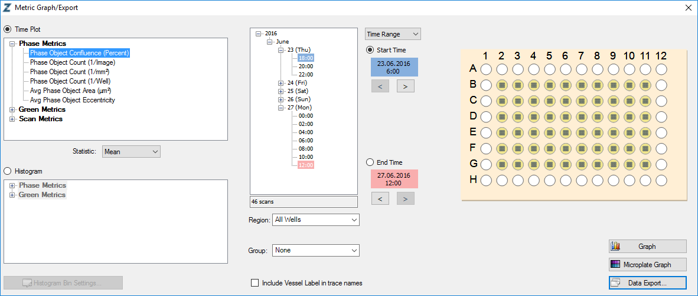
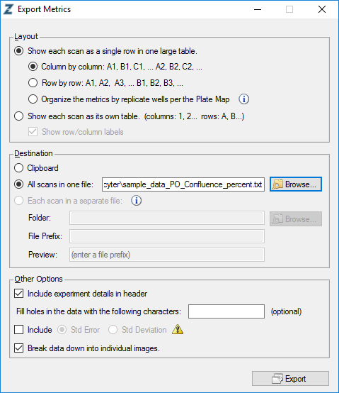

`incucyter` is an R package to read, annotate, normalise and plot IncuCyte ZOOM® metrics.

# Installation  

```

if(!library(devtools, logical.return = T)) install.packages("devtools")
if(!library(tidyverse, logical.return = T)) install.packages("tidyverse")
devtools::install_github("uhlitz/incucyter")

```

# Quick start 

You can use incucyter to...

1. read + annotate
2. normalise
3. plot 

...IncuCyte ZOOM® metrics.

To do so, export your incucyte metrics with IncuCyte ZOOM® software using the following settings. File names are not relevant, all other settings are mandatory for `incucyter` to properly import the data:





## 1 read + annotate

Example code to read and annotate incucyte metrics:

```{r, message=F, warning=F}

library(tidyverse)
library(incucyter)

example_data <- system.file("extdata", 
                            c("sample_data_GO_Confluence_percent.txt",
                              "sample_data_PO_Confluence_percent.txt"),
                            package = "incucyter")

example_annotation <- system.file("extdata", 
                                  "sample_data_annotation.tsv",
                                  package = "incucyter")

incu_tbl <- read_incu(file = example_data,
                      annotation = example_annotation)

```

Your annotation table must contain three columns: Analysis_Job, Well, Treatment, Reference. To annotate your table, you can use `read_incu` with a file path to a tab delimited annotation file or with a R `data.frame`. 

You can freely add other columns and use these columns to summarise your data for plotting or summary statistics.

An example annotation can look like this: 

```{r, echo=F, message=F, warning=F}

library(knitr)
read_tsv(example_annotation) %>% 
  slice(1:20) %>% 
  kable

```

## 2 normalise

You can normalise your data to a reference metric and/or to a set of referece wells.
For the first, `calc_incu_ratios` calculates all ratios between the different metrics in your table. These ratios can be plotted with `plot_metric` like any other metric. For the latter, `norm_incu` normalises your metrics to a given reference time point and a given set of reference wells (specified as a column in your annotation table, see above). 

```{r}

incu_tbl_comp <- calc_incu_ratios(incu_tbl)
incu_tbl_comp_norm <- norm_incu(incu_tbl_comp, ref_time = 72)

```

## 3 plot

You can plot multiple metrics with `plot_metrics` or a microplate overview plot with `plot_microplate`.

```{r}

incu_tbl_comp_norm %>% 
  filter(is.na(siRNA)) %>% 
  plot_metrics(color = c("Treatment", "Inhibition"), 
               label = c("Treatment", "Inhibition"), summarise = T)

```

```{r}

incu_tbl %>% 
  filter(Metric == "Green_Confluence") %>% 
  plot_microplate(color = c("Treatment", "Inhibition"))

```


